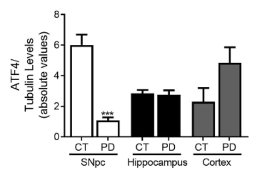
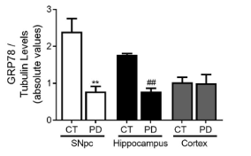
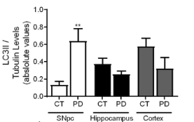

Groepsnummer: 2C

Groeps leden: Sjanne Bogers Anna Kamsteeg Finn Mesker Maryse Nas

HML file: by clicking on Knit!
samenwerking via GitHub


```{r}
```

# Introductie

### Doel opdracht

Met deze opdracht ga je je kennis, begrip en vaardigheden op het gebied van R, statistiek en bio-informatica toepassen voor het oplossen van een biomedisch vraagstuk. Hierbij zullen we de onderzoekscyclus volgen. Beginnend met het opstellen van een hypothese tot het speculeren over vervolgvragen die het onderzoek opwekt.

Het onderwerp is **ziekte van Parkinson (PD)**. In de opdracht zullen we onderzoeken of we de differentiële expressie van bepaalde eiwitten in verschillende delen van de hersenen van PD-patiënten ook kunnen terugvinden in de RNA-expressie van het bijbehorende gen. De datasets die we gebruiken zijn publiek beschikbaar op de GEO database (RNA-seq dataset).

### Inleveren en beoordeling

De vragen en opdrachten worden ingeleverd voor een cijfer. Bij iedere opdracht staat vermeld hoeveel punten je kunt krijgen. Lever de antwoorden op de vragen en de code in als *RMarkdown file* of *R-script* met daarin de **code**, begeleid door voldoende **notities**. De code moet logische namen bevatten, dus noem je variabelen (bijv. dataframes) niet "v1" of "df", maar zoiets als "PD_database" of "controls_table". Ook moeten de notities begrijpelijk zijn voor een buitenstaander. Zorg ervoor dat de notities kort en bondig zijn, maar wel volledig. Figuren moeten direct leesbaar zijn voor een buitenstaander, d.m.v. het gebruik van titels, aslabels en bijvoorbeeld een legenda. De beoordeling van deze opdracht zal als volgt zijn:

-   50% van de punten zijn voor antwoorden op de vragen. Hierbij zal er zijn aangegeven dat er een antwoord verwacht wordt. Dan zal je de onderstaande regel zien (zichtbaar in het .Rmd bestand), en kan je jouw antwoord invullen op de plek van 'Antwoord'.

[*Antwoord*]{style="color:red"}

-   50% van de punten zijn voor juist werkende code – het script moet dus ook voor de docent werken, inclusief correcte en volledige annotatie. Hierbij zal het codeblok worden weergegeven:

```{r}
# Type hier de uitleg van wat je doet en hieronder de code, bijvoorbeeld:
# Maak een boxplot van de 'sepal length' voor alle bloemen in de iris dataset
boxplot(iris$Sepal.Length)
```

De opdracht telt mee voor 10% van het eindcijfer van de cursus. Dit cijfer is een groepscijfer waarbij iedereen hetzelfde cijfer krijgt. Je mag bij gegronde redenen onderling de punten anders verdelen. Stuur in dat geval een duidelijke motivatie mee naar de cursuscoördinator bij het inleveren van de opdracht. Zet duidelijk de **namen, studentnummers en het groepsnummer bovenin het bestand** en **vul de reflectie AI in**. De inleverdatum is **16 maart 2026 om 10:00 uur** op Brightspace. Inleveren na deze deadline resulteert in het cijfer `1`.

### Bonuspunten

Het gebruik van RMarkdown in plaats van een R-script wordt sterk aangeraden voor het creëren van overzicht: Figuren en data blijven geladen wanneer ze aangemaakt zijn, zodat je gemakkelijk terug kunt zien wat voor resultaten je hebt verkregen bij de verschillende vragen. Dit is wel nieuwe stof en zal daarmee op het begin extra tijd kosten, maar op termijn waarschijnlijk tijd besparen. Hierbij een link naar een kort filmpje dat laat zien wat je met een RMarkdown file kunt doen: <https://rmarkdown.rstudio.com/lesson-1.html>.

-   Een RMarkdown file met daarin de vragen en code blokken staat op Brightspace. Als je gebruik maakt van RMarkdown krijg je 3 bonuspunten toegekend voor het onderdeel code met annotatie.
-   Het exporteren van RMarkdown naar een (leesbaar) html bestand levert 2 bonuspunten op. Wanneer een print van de RNA seq dataset 50% van de ruimte het html bestand in beslag neemt krijg je deze bonuspunten niet.\
-   Sommige opdrachten zijn wat lastiger en niet verplicht. Met het maken van deze opdrachten kun je ook bonuspunten verdienen. Dit staat aangegeven bij de desbetreffende vragen.
-   Bonuspunten worden opgeteld bij de andere punten tot maximaal het cijfer 10.

### Tips

-   Als je bij codeervragen niet weet welke functie er nodig is of hoe en fuctie werkt, kan je het beste Google of een LLM (Claude, Gemini, ChatGPT...) gebruiken om erachter te komen. Hiervoor typ je het vraagstuk zo specifiek mogelijk in, met de codeer-taal die je wilt gebruiken (R). Stackoverflow is een voorbeeld van een forum met nuttige informatie. Mocht je een LLM, zoals bijv. ChatGPT gebruiken, geef dan duidelijke instructies. Vraag niet alleen welke functie gebruikt moet worden, maar ook **waarom** deze functie.
-   Als je problemen met je eigen code hebt (errors etc), dan mag je (nooit verplicht!) ook GenAI gebruiken. We gebruiken hierbij de **index 3** van de [AI-index voor studenten](https://www.uu.nl/media/120115). Dus, vraag hier geen antwoord, maar hints, zodat je optimaal leert.
-   Maak gebruik van de kennis en ervaring van je medestudenten uit de groep. Dat betekent dat je hulp en uitleg kunt vragen, niet dat je het de ander moeten laten uitvoeren. Op de toets moet je het uiteindelijk zelf doen. ;)
-   Voor RMarkdown: Als je een functie runt met meerdere regels binnen een code block, dien je deze lines tegelijkertijd te selecteren en runnen. Anders krijg je een foutmelding. Dit geldt bijvoorbeeld voor het maken van een figuur of het uitvoeren van een for-loop.
-   Als je plaatjes uit het artikel wilt plakken in je html bestand kan dat met de onderstaande code. Let erop dat het bestand ook in de betreffende map (working directory) staat.


### Beschikbare tijd

Voor deze opdracht is de geschatte tijdsinvestering 10 uur. Afhankelijk van je ervaring en feeling met R en statistiek, evenals het uitvoeren van de bonusopdrachten kan dat afwijken.

> Veel succes en plezier met de opdracht!

### Belangrijk

Laad libraries voor correct gebruik functies.

```{r message = FALSE, warning=FALSE}

options(scipen=999) # This just keeps R from using scientific notation that can be a bit confusing
library(car)
```

------------------------------------------------------------------------

# Opdracht

De klinische karakteristieken van PD komen helaas pas tot uiting in een vergevorderd stadium, waardoor klinische interventie pas kan plaatsvinden wanneer er al onomkeerbare schade is aangericht aan de hersenen. Om deze redenen worden momenteel verschillende bio-informatica tools ontwikkeld voor vroegtijdige herkenning van de ziekte van PD in patiënten. Zo wordt er gekeken in bloedsamples of er bepaalde biomarkers aanwezig zijn. Ook wordt er met behulp van RNA-seq data bepaald welke genen anders tot expressie komen in PD-patiënten. Hiermee kunnen belangrijke gen-targets van PD geïdentificeerd worden, die eventueel gebruikt kunnen worden voor het ontwikkelen van nieuwe medicatie die de veranderde expressie tegengaat. Veranderde genexpressie betekent echter niet automatisch veranderde eiwit-expressie, door verschillende regulatiemechanismen. Andersom betekent een veranderde eiwitexpressie ook niet automatisch een veranderde genexpressie. Dit bemoeilijkt de zoektocht naar geschikte gen-targets.

In de volgende opdracht zullen we ons gaan verdiepen in twee eiwitten naar keuze waarvan al via Western Blot analyses vastgesteld is dat ze belangrijk zijn voor het ontstaan van PD. Voor de gevonden eiwitten zullen we verder duiken in RNA-seq expressiedata uit een onafhankelijke onderzoek van PD-patiënten en gezonde controles. Hierbij zullen we onderzoeken of de genexpressies significant verschillen tussen mensen met PD en gezonde controles.

### Eiwit-expressie analyse

Het artikel van Esteves & Cardoso (Ref. 1) dat gebruikt wordt voor de opdracht is te vinden met [deze link](https://www.nature.com/articles/s41598-020-70174-z).

#### Vraag 1 (3 punten)

Vind in het gegeven artikel **twee** eiwitten die anders tot expressie lijken te komen in de substantia nigra in de hersenen van PD-patiënten vergeleken met controles. De eiwitten hoeven niet statistisch significant anders tot expressie te komen. Maak screenshots van onderdelen uit de figuren uit het artikel die laten zien dat de door jullie gekozen eiwitten anders tot expressie komen. Maak een **passend bijschrift** voor de afbeeldingen, waardoor direct te begrijpen valt wat er in de afbeelding te zien is. (3)

> Een afbeelding kun je op de volgende manier invoegen:

*Let erop dat het bestand ook in de betreffende map (working directory) staat.*







### Opstellen hypothese en onderzoeksopzet

#### Vraag 2 (5 punten)

a)  Is de onderzoeksopzet van Esteves & Cardoso observationeel of experimenteel? Licht kort toe. (1)

*Je hoeft het artikel hier niet voor te lezen, maak gebruik van de info in de introductie.*

[*Dit is een expirimenteel onderzoek, want ze gaan zelf onderzoeken van welke proteins de expressionlevels afwijkend zijn*]{style="color:red"}

b)  De onderzoeksopzet van Esteves & Cardoso is cross-sectioneel. Leg uit waarom dit onderzoek niet prospectief zou kunnen worden uitgevoerd - denk daarbij aan hoe onderzoekers aan de samples komen. (1)

[*Antwoord*]{style="color:red"}

c)  Wat betekent "informed consent" in verband met hersenen-samples in een "Tissue Bank"? Bekijk voor de aantwoord ook de website van de [Netherlands Brain Bank](https://www.brainbank.nl/brain-tissue/donor-program/). (1)

[*Antwoord*]{style="color:red"}

d)  Je gaat nu een vervolgonderzoek doen op het artikel. Je zult een dataset uit een andere studie analyseren, waarin je de RNA-expressie onderzoekt van de genen die coderen voor de twee eiwitten die je bij vraag 1 hebt gekozen. Formuleer een onderzoeksvraag over de RNA-expressie van de gekozen genen bij mensen met de ziekte van Parkinson vergeleken met gezonde controlegroepen. Maak de vraag duidelijk en gefocused.

[*Antwoord*]{style="color:red"}

e)  Stel een nulhypothese en een alternatieve hypothese op bij de onderzoeksvraag. (1)

[*Antwoord*]{style="color:red"}\

### Verkennen van data

Voor de gekozen eiwitten zullen we gaan onderzoeken of hun veranderde expressie veroorzaakt kan worden door veranderde RNA-expressie. We hebben een RNA-seq dataset met de naam *count_matrix.txt*. Dit dataset is onafhankelijk van de artikel, omdat we een vervolgonderzoek doen. Let op: de gennamen in de RNA-seq dataset zijn HGNC symbolen. Zoek daarom eerst op wat de HGNC symbolen zijn van de twee gekozen eiwitten. Dit kan op [deze website](https://www.genenames.org/data/gene-symbol-report/#!/). Benoem de twee genen. (geen punten)\
*Let op! Het is soms even puzzelen en niet alle gennamen van de betreffende eiwitten zijn terug te vinden in de RNA-seq database. Kies in dat geval een ander eiwit.*

#### Vraag 3 (5 punten)

Als aan ChatGPT gevraagd wordt om de data in te laden voor dit deel van de opdracht, wordt de volgende code gegeven:

```{r}
#count_data <- read.csv("PD_count_matrix_csv", row.names = 1)
```

a)  Als deze code getest wordt, geeft dit een foutmelding. Welke fout(en) heeft ChatGPT hier gemaakt? (1)\
    *De "\#" voor de code is nodig om het bestand later naar een HTML-bestand te kunnen knitten. Dit kan namelijk niet als er een foutmelding in de R-code van het bestand staat. Als je de "\#" verwijdert om de code te testen, plaats deze dan weer voor je het bestand knit.*

[*Met deze code gaat R er vanuit dat de data een "," als separator heeft, maar als je het bestand opent zie je dat de data gescheiden word met een tab.* ]{style="color:red"}

b)  Schrijf code om de data wel goed in te laden. Laat daarna de eerste 6 rijen zien. (1)

```{r}
#inladen van PD data:
PD_data <- read.delim('PD_count_matrix.txt')

#eerste 6 rijen geven:
head(PD_data)
```

c)  Hoeveel samples zijn van controles en hoeveel van PD-patiënten? Lees je antwoord af uit het antwoord van de vorige vraag. (1)

[*Er zijn b controles en 8 patiënten, te zien aan de kolom namen*]{style="color:red"}

d)  Hoeveel genen zijn onderzocht? (1)

[*In de data environment is te zien dat het 23900 observaties zijn, dat komt dus overeen met het aantal genen die ze hebben onderzocht*]{style="color:red"}

e)  Als je duizenden genen tegelijk onderzoekt, is de kans groot dat er bij enkele metingen iets misgaat. Controleer daarom of er in dit tabel meetwaarden ontbreken (dus, of er "NA" meetwarden zijn). (1)

```{r}
#controleren op NA's
colSums(is.na(PD_data))
```

[*Dit laat zien dat er geen NA's in de data frame zitten*]{style="color:red"}

#### Vraag 4 (9 punten)

a)  Selecteer alle kolommen voor de Controls voor èèn van je gekozen genen en sla deze op in nieuwe dataframe. Doe hetzelfde voor alle PD-kolommen voor hetzelfde gen. (1)

```{r}
# 
```

b)  Geef een overzicht van de counts van de genen die jij gekozen hebt. Gebruik de functie `summary()`. Hint: de functie `summary()` werkt normal gesproken met kolommen in plaats van rijen. Wissel daarom kolommen en rijen in je nieuwe dataframes met behulp van de functie `t()` (bijv. voor dataframe `x`: `summary(t(x))`). (1)

```{r}
# 
```

c)  Wat betekent de mediaan uit de bovenstaande summaries? Is de mediaan hoger in de Control of in the PD samples voor jouw gen? (1)

[*Antwoord*]{style="color:red"}

d)  Bereken het gemiddelde voor alle genen tegelijk voor de Controls en de PD-samples met behulp van de functie `apply()` en sla ze op in een nieuwe variabel. Maak hiervoor eerst een kolomselectie (dus maak èèn dataframe voor Controls en èèn voor PD). (3)

```{r}
# 
```

e)  Welk gen heeft de hoogste expressie in de Controls? Welk gen heeft de hoogste expressie in de PD-samples? (2)

```{r}
# 
```

f)  Gebruik de funcie `table()` om te vinden hoe veel genen in de PD samples een hogere gemiddelde RNA-expressie hebben dan in de controls. (1)

```{r}
# 
```

## RNA-expressie analyse

#### Vraag 5 (12 punten)

a)  Plot de distributie van alle *gene counts* per sample, voor alle samples in één plot. Transformeer de data met een log2-transformatie voor de visualisatie. Voeg 1 toe aan alle gene counts voordat je de transformatie toepast, om errors te voorkomen (log2(0) bestaat niet). Denk goed na over de titel op de y-as. (3)

```{r}
# Maak een boxplot van getransformeerde waarden. 
# 
```

Net zoals in het COO RNA-seq willen we genen die een lage of geen expressie hebben verwijderen uit onze dataset omdat ze geen nuttige informatie bevatten.

b)  Selecteer alleen de genen die in ten minste 75% van de samples tot expressie komen. (2)

```{r}
# 
```

c)  Bepaal hoeveel genen er oorspronkelijk aanwezig waren en hoeveel je er nu over hebt. (1)

```{r}
# 
```

d)  Ook genen met lagere expressie zijn over het algemeen minder interessant voor analyse. Verwijder de genen met lage expressie (gemiddelde expressie per gen \< 5). Volg hiervoor het volgende stappenplan:

<!-- -->

1.  Bereken de gemiddelde expressie per gen voor alle samples samen. Sla de resulterende vector op in een nieuwe variabele. (2)\
2.  Check welke gemiddelde genexpressiewaardes hoger zijn dan 5. Hieruit krijg je een logical vector met TRUE / FALSE waarden. Sla deze zogeheten ‘boolean vector’ op als een nieuwe vector. (1)\
3.  Selecteer met behulp van de boolean vector de juiste genen van de RNA-seq dataset die een **hogere gemiddelde expressie hebben dan 5 counts** in alle samples samen. (2)\
4.  Maak ook een dataframe aan met daarin de genen van de RNA-seq dataset die een **gemiddelde expressie hebben van 5 counts of lager**. (1)\
5.  Controleer of je subselectie gelukt is in de verschillende dataframes.

```{r}
# 
```

### Opstellen onderzoeksplan

We willen onderzoeken of de expressie in veschillende genen anders is in PD-patiënten dan in gezonde controles. Om te zien welke statistische toetsen er gebruikt kunnen worden voor de data, dient van tevoren bekeken worden of de data aan bepaalde voorwaarden voldoet. Ook voor een t-toets, waar onze voorkeur naar uitgaat, moet de data aan bepaalde voorwaarden voldoen.

#### Vraag 6 (4 punten)

a)  Aan welke voorwaarden moet de data voldoen voor data-analyse met een t-toets? (2)

[*Antwoord*]{style="color:red"}

b)  Welke t-toets moet uitgevoerd worden, een één-steekproef t-toets, een gepaarde t-toets of een twee onafhankelijke steekproeven t-toets? Licht je antwoord toe. (2)

[*Antwoord*]{style="color:red"}

Om de aannames te controleren, gaan we de data visualiseren.

#### Vraag 7 (2 punten)

a)  Maak een nieuw dataframe waarin de kolommen omgewisseld zijn met de rijen in je dataset– dit wordt ook wel transponeren genoemd. Gebruik als input de dataset uit vraag 5d. Gebruik de functie `t()`. (1)

```{r}
# 
```

Gebruik dit getransponeerde dataframe in de rest van de vragen.

b)  Straks ga je een t-toets uitvoeren om verschil in genexpressie te bepalen. Hierbij willen we de functie `t.test()` gebruiken, waarbij we de variabelen in de kolommen gaan toetsen. Waarom is het hiervoor nodig om de data eerst te transponeren? (1)

[*Antwoord*]{style="color:red"}

#### Vraag 8 (14 punten)

a)  Maak **twee figuren** van het expressie-level van de genen van de twee gekozen eiwitten van PD-patiënten ten opzichte van gezonde controles, dus één figuur per gen met daarin zowel de expressie van PD als controle. Maak hiervoor eerst een nieuwe kolom die aangeeft of een bepaalde rij een patiënt of controle bevat. (4)

```{r}
# 
```

b)  Voldoet de RNA expressie van de genen die je hebt gekozen om te onderzoeken in vraag 1 aan de voorwaarden voor een t-toets? Leg dit mede uit aan de hand van de boxplot gemaakt bij de vorige vraag. (2)

[*Antwoord*]{style="color:red"}

c)  Het gevaar bij het gebruik van een boxplot om een verdeling te bepalen, is dat een boxplot een bimodale verdeling kan verbergen. Wat is een bimodale verdeling, en waarom kan deze moeilijk te herkennen zijn in een boxplot? (2)

[*Antwoord*]{style="color:red"}

d)  Controleer de verdeling van het expressie-level van de genen van de twee gekozen genen met behulp van qq-plots (bijv. met functie qqPlot uit de library "car"). (4)

```{r}
# 
```

e)  Bepaal of de data voldoen aan de voorwaardes van een t-toets. Gebruik in je antwoord de figuren gemaakt bij vraag 8a en 8b. (2)

[*Antwoord*]{style="color:red"}

### Toetsen

#### Mini-Intermezzo: For loops (2 punten)

Zometeen gaan we de p-waarden voor alle parameters tegelijk bepalen met een for loop. Daarvoor kijken we eerst naar hoe for loops werken. In de onderstaande code wordt het woord *Bio-informatica* omgezet in een vector van losse karakters. Hierbij worden de nieuwe functies `nchar()` en `substring()` gebruikt. `nchar()` geeft het aantal tekens in een character variabele terug (de lengte van het woord) en `substring()` haalt een specifiek karakter uit een character variabele op. De exacte werking van deze twee functies is niet belangrijk voor nu, probeer te begrijpen wat de code doet. Run de code om te kijken wat de code doet. (geen punten)

```{r}
# Voorbeeld van een for loop
woord <- "Bio-informatica"  # Het woord waarmee we werken
woord_als_vector <- c()  # Maakt een lege vector aan

# De for loop loopt door elk karakter van het woord
for (i in 1:nchar(woord)) { 
  woord_als_vector <- c(woord_als_vector, substring(woord, i, i))  # Voegt de i-de letter toe aan de lege vector
}
woord_als_vector # Print de vector van losse karakters

```

Pas de bovenstaande code aan zodat jouw naam als losse karakters in een vector wordt gezet. Sla deze vector op als `mijn_naam`. In het ingeleverde bestand van de opdracht hoeft maar één naam uit de groep gebruikt te worden. (2)

```{r}
# For loop
naam <- "Anna"  # Het woord waarmee we werken
mijn_naam <- c()  # Maakt een lege vector aan

# De for loop loopt door elk karakter van het woord
for (i in 1:nchar(naam)) { 
  mijn_naam <- c(mijn_naam, substring(naam, i, i))  # Voegt de i-de letter toe aan de lege vector
}
mijn_naam
```

#### Vraag 9 (4 punten)

Nu, gebruik een for loop om voor alle genen te bepalen of ze anders tot expressie komen. Onafhankelijk van het antwoord bij de qqplots gebruik je hiervoor een t-toets. Bepaal hoeveel van de parameters statistisch significant van elkaar verschillen tussen PD-patiënten en controles. Gebruik α = 0.05. (4)\
*Hint: Je kunt de t-toets zowel runnen op basis van twee verschillende datasets die met elkaar vergeleken worden (optie a), als door middel van het splitsen van een enkele dataset binnen t.test via een formule-notatie (`~`), waarbij een kolom gebruikt wordt om aan te geven in welke groep iemand zit: patiënt of controle (optie b).*

Wat hulp om de for-loop te creëren:

1)  Bepaal welke parameters je wilt gebruiken om overheen te 'loopen'. **Belangrijk**: Verwijder alle niet numerieke parameters van tevoren!
2)  Includeer een counter om de locatie te kunnen specificeren binnen een vector waar je de uitkomst van de test in opslaat.
3)  Bewaar de uitkomst van de statistische test in een variabele.
4)  Bewaar de p-waarde van de statische test in vector `p_value_vector` op een gespecificeerde locatie.
5)  Schrijf de naam van de parameter in vector `p_value_vector` op een gespecificeerde locatie.

Vergeet niet om eerst de `p_value_vector` en de `counter` aan te maken voordat je de `for-loop` runt! Anders zal R de for-loop niet willen runnen, omdat de variabelen die ervoor nodig zijn niet bestaan.

Uiteindelijk zou de vector p_value_vector de p-waardes voor elke gen moeten bevatten.

```{r}
# 
```

#### Vraag 10 (4 punten)

a)  Leg in je eigen woorden uit wat een p-waarde is. Gebruik hierbij ook het begrip *fout positief*. (1)

[*Antwoord*]{style="color:red"}

b)  Stel dat er voor 200 verschillende parameters testen uitgevoerd worden of deze anders tot expressie komen bij PD-patiënten dan bij gezonde controles. Hoeveel van deze testen zal gemiddeld fout positief uitslaan bij α = 0.05? (1)

[*Antwoord*]{style="color:red"}

c)  Hoe heet de soort correctie die toegepast moet worden? Waarom is het noodzakelijk om deze correctie toe te passen? (2)

[*Antwoord*]{style="color:red"}

### Intermezzo -- Corrigeren van p-waarden

Voor het corrigeren van p-waarden zijn verschillende methoden beschikbaar. Twee van de meest-gebruikte methoden zijn Bonferroni en Benjamini-Hochberg (BH).

Bij Bonferroni-correctie wordt de drempel (bijv. 𝛼 = 0.05) voor significantie aangepast om het risico op fout-positieve resultaten (type I fouten) te beperken. De oorspronkelijke grens wordt gedeeld door het aantal uitgevoerde testen. In plaats van de drempel te verlagen kunnen we ook de verkregen p-waardes vermenigvuldigen met het aantal testen en de p-waarde vergelijken met de oorspronkelijke 𝛼. Ter illustratie is hieronder een tabel weergegeven met verschillende, bonferroni gecorrigeerde p-waardes.

| p-waarde | Berekening Bonferroni | Bonferroni p-waarde |
|:---------|:----------------------|:--------------------|
| 0.001    | 0.001 \* aantal tests | 0.005               |
| 0.002    | 0.002 \* aantal tests | 0.010               |
| 0.021    | 0.021 \* aantal tests | 0.105               |
| 0.044    | 0.044 \* aantal tests | 0.220               |
| 0.061    | 0.061 \* aantal tests | 0.305               |

*Tabel - Voorbeeld correctie van p-waardes met Bonferroni. Aantal testen = 5.*

Bij BH wordt de p-waarde gecorrigeerd op basis van de ranking van de p-waardes qua hoogte. De p-waarden worden geordend van laag naar hoog en er wordt een nummer gegeven aan hun positie (‘ranking’). Vervolgens worden de p-waardes vermenigvuldigd met het totale aantal onafhankelijke testen dat uitgevoerd is, net zoals bij Bonferroni. Daarnaast worden ze bij deze BH test ook nog gedeeld door de ranking van de p-waarde. Alle testen met een BH p-waarde kleiner dan alfa worden dan aangemerkt als significant. Dit leidt er in de praktijk toe dat voornamelijk de lage p-waarden verhoogd worden, en de hogere p-waardes minimaal hoger worden.

| p-waarde | Berekening BH          | Ranking | BH p-waarde |
|:---------|:-----------------------|:--------|:------------|
| 0.001    | 0.001 \* \# tests/rank | 1       | 0.005       |
| 0.002    | 0.002 \* \# tests/rank | 2       | 0.005       |
| 0.021    | 0.021 \* \# tests/rank | 3       | 0.035       |
| 0.044    | 0.044 \* \# tests/rank | 4       | 0.055       |
| 0.061    | 0.061 \* \# tests/rank | 5       | 0.061       |

*Tabel - Voorbeeld correctie van p-waardes met Benjamini-Hochberg. Aantal testen = 5. De eerste drie testen zijn significant, want de BH p-waarde van rank 3 is lager dan 0.05, maar vanaf rank 4 niet meer.*

------------------------------------------------------------------------

#### Vraag 11 (9 punten en 2 bonuspunten)

a)  Corrigeer de p-waardes met behulp van de correctie-methoden Bonferroni en Benjamini-Hochberg.\
    *Hint: gebruik hiervoor de functie `p.adjust()`.* (2)

```{r}
# 
```

b)  Laat de vector met ongecorriceerde p-waardes en beide vectoren met gecorrigeerde p-waardes zien. Bepaal met behulp van code of de correcties ervoor zorgen dat andere hoeveelheden sginificant verschillende parameters ontstaan. (2)

```{r}
# 
```

c)  Bepaal welke van de twee correctiemethoden het meeste corrigeert. Leg met behulp van de uitleg over hoe de correcties werken uit waarom deze strenger corrigeert. (2)

[*Antwoord*]{style="color:red"}

**Bonusvraag d)** Kijk goed naar de gecorrigeerde p-waarden die zijn berekend met de Benjamini-Hochberg-methode. Bij de Benjamini-Hochberg-methode kunnen gecorrigeerde p-waarden soms gelijk zijn, terwijl de corresponderende ongecorrigeerde p-waarden verschillen. Leg uit hoe dit kan gebeuren. (2 bonuspunten)

[*Antwoord*]{style="color:red"}

In de wetenschap worden p-waardes niet altijd gecorrigeerd. Aangezien de ongecorrigeerde p-waardes altijd lager uitvallen dan de gecorrigeerde waardes, is het als wetenschapper verleidelijk om voornamelijk gebruik te maken van ongecorrigeerde waarden. Immers, significante resultaten zijn mogelijk aantrekkelijker om te publiceren. Rondom de correctie van p-waardes is er hierdoor sprake van een ethische kwestie.

e)  Zowel de gecorrigeerde p-waarde als de ongecorrigeerde p-waarde zouden gebruikt kunnen worden voor het beantwoorden van de onderzoeksvraag over de genen naar keuze uit **vraag 1** voor het gebruik bij het voorspellen van gen-expressie. Wanneer zou je de gecorrigeerde p-waarde gebruiken, en wanneer de ongecorrigeerde? Beargumenteer beide situaties. (2)

[*Antwoord*]{style="color:red"}

f)  Zou je zeggen dat het gebruik van een ongecorrigeerde p-waarde als onderzoeker ethisch verantwoord is binnen een *clinical trial*? Beargumenteer je antwoord. (1)

[*Antwoord*]{style="color:red"}

------------------------------------------------------------------------

### Zoom in op je gekozen genen

#### Vraag 12 (7 punten)

Laat zien wat de p-waardes van de genen van de twee gekozen eiwitten uit het artikel zijn en bewaar deze in een nieuwe vector. Gebruik hierbij de `%in%` operator. (2)

`%in%` geeft een boolean vector die aangeeft of er een match aanwezig is of niet, en kan daarmee specifieke rijen of kolommen selecteren vanuit een dataframe. De `%in%` operator is al eerder voorbij gekomen in het COO RNA-seq. Hieronder staat een ander voorbeeld weergegeven.\
*Als het niet lukt om de ongecorrigeerde p-waardes te laten zien met de `%in%` operator, mag dit ook met andere code. Dit levert slechts 1 van de 2 punten op.*

```{r}
# Voorbeeld %in% operator (dit voorbeeld mag verwijderd worden en/of vervangen door het antwoord op deze vraag)

a <- seq(1:10)
b <- c(1,2)

a %in% b

# Kijkt of waardes uit a voorkomen in b. Geeft booleans (TRUE & FALSE) terug. 
# Waardes 1 en 2 uit b zijn allebei aanwezig in vector a, de rest niet. 
# Daarom worden de eerste twee booleans TRUE, en de rest FALSE 

#Eigen code:


```

b)  Voer nu de t-toets opnieuw uit voor je geselecteerde genen, zodat je alle berekende waarden kunt bekijken (inclusief bijvoorbeeld het betrouwbaarheidsinterval). (1)

```{r}

# 

```

c)  Wat is je conclusie met betrekking tot de genexpressie van de twee genen die je op basis van de verschillende eiwitten uit het artikel hebt bekeken? Kies hierbij zelf of dit gedaan wordt met de gecorrigeerde of ongecorrigeerde p-waardes en leg deze keuze uit. (2)

[*Antwoord*]{style="color:red"}

d)  Geef een korte verklaring (max. 10 regels) bij de gevonden resultaten: wat zijn **twee** mogelijke verklaringen waarom de genen wel/niet anders tot expressie komen? (2)

[*Antwoord*]{style="color:red"}

### Analyse verbanden tussen genen

De onderzoeksvraag of er een significant verschil is in expressie van de genen van jouw twee gekozen eiwitten tussen PD-patiënten en controles is nu beantwoord. In vervolgonderzoek zou je breder kunnen kijken naar correlaties tussen genexpressies in de hele dataset. Een mogelijke methode hiervoor is een pathway-analyse.

#### Vraag 13 (2 punten)

a)  Wij hebben nu maar twee genen bekeken. De dataset bevat informatie over de expressie van veel genen, waarmee ook een pathway-analyse uitgevoerd zou kunnen worden. Leg in maximaal 5 regels uit wat een pathway-analyse is. (1)

[*Antwoord*]{style="color:red"}

b)  Hoe kan een pathway-analyse in de context van dit onderzoek nuttig zijn? (1)

[*Antwoord*]{style="color:red"}

#### Vraag 14 (9 punten)

Omdat een pathway-analyse te complex is om nu uit te voeren in R, gaan wij alleen kijken naar het verband tussen jouw twee gekozen genen. Dit doen we ongeacht de resultaten bij vraag 12 significant waren. De onderzoeksvraag is hierbij 'In hoeverre is er een verband tussen de genexpressie van gen A en de genexpressie van gen B?' Dit zouden we uit kunnen voeren voor zowel de PD-patiënten, als voor de controles, als voor beide groepen samen. We gaan dit echter **alleen voor de PD-patiënten** doen.

a)  Stel een nulhypothese en alternatieve hypothese op bij de onderzoeksvraag: *'In hoeverre is er een verband tussen de genexpressie van gen A en de genexpressie van gen B in PD-patiënten?'* (Vul hierbij de namen van jouw twee gekozen genen in) (1)

[*Antwoord*]{style="color:red"}

b)  Aan welke aannames moet voldaan worden als we een correlatie toetsen? (2)

[*Antwoord*]{style="color:red"}

c)  Voer nu de toets uit en volg de onderstaande stappen:\
    *Je hoeft hierbij alleen de R-code uit te voeren. In de volgende vragen gaan we dit interpreteren.*

<!-- -->

1.  Selecteer alleen de samples van PD-participanten uit de dataframe uit **vraag 8** en sla dit op als een nieuwe dataframe. (0,5)

```{r}
# 

```

2.  Visualiseer de data met behulp van een scatterplot. (0,5)

```{r}
# 

```

3.  Maak een figuur om de aannames voor de toets te controleren. (1)

```{r}
# A

```

4.  Toets het verband door de p-waarde en andere relevante statistieken te bepalen. (1)

```{r}
# 

```

d)  Voldoen de data aan de voorwaardes voor correlatie analyse? (1)

[*Antwoord*]{style="color:red"}

e)  Onafhankelijk van het antwoord op vraag 14d: Wat is je conclusie over het verband tussen de genexpressie van jouw twee gekozen eiwitten? Leg in maximaal 3 regels uit wat deze conclusie in biologische zin zou kunnen betekenen. (2)

[*Antwoord.*]{style="color:red"}

### Beantwoorden onderzoeksvraag

#### Vraag 15 (5 punten)

a)  Beantwoord met behulp van de juiste p-waardes de onderzoeksvraag die je bij **vraag 1** hebt opgesteld. (3)

[*Antwoord*]{style="color:red"}

b)  Welke impliciete aanname wordt gemaakt over de representativiteit van RNA-expressie in hersenweefsel dat enkele uren postmortem is afgenomen? (1)

[*Antwoord*]{style="color:red"}

c)  Waar moet je op letten bij het selecteren van geschikte controles voor het onderzoek? Wat zijn de beperkingen hiervan, gezien de manier waarop de samples worden genomen? (1)

[*Antwoord*]{style="color:red"}

Met het beantwoorden van de onderzoeksvraag en het bedenken van een vervolgonderzoek zijn we op het eind aangekomen van deze onderzoekscyclus.

# Reflectie generatieve AI

Generatieve AI wordt steeds meer gebruikt door studenten. Het kritische gebruik van AI kan helpen om de eindproducten naar een hoger niveau te brengen. Wel kleven er risico's aan het gebruik van AI. Het is daarom goed om te reflecteren op het gebruik van genAI.

#### Vraag 16 (2 punten)

Beschrijf kort (max. 10 regels) of (en zo ja, hoe) jullie **per person** gebruik gemaakt hebt van genAI tijdens deze opdracht en geef je overwegingen om het wel of niet te gebruiken. Leg daarbij uit in hoeverre het ingeleverde product echt van jullie zelf is. (2)

[*Antwoord*]{style="color:red"}

## Einde

Dit brengt ons aan het einde van de PD-opdracht. De opdrachten en antwoorden ontvangen we graag via Brightspace (Cursusinhoud \> Opdracht PD \> Inleveren PD Opdracht). Er zal een gezamenlijke nabespreking gehouden worden over de opdracht op maandag 16-03-2025 om 10:00. Aanwezigheid bij deze nabespreking is niet verplicht, maar wordt wel sterk aangeraden; er zullen ook toetsvragen komen over dit onderdeel. Hopelijk tot dan!

### Bronnen

-   [1] Esteves A.R. & Cardoso S.M. Differential protein expression in diverse brain areas of Parkinson's and Alzheimer's disease patients. 13149 (2020).
-   [2] Jafari M, Ansari-Pour N. Cell J. Why, When and How to Adjust Your P Values?. 2019;20(4):604-607. <doi:10.22074/cellj.2019.5992>.

> EINDE

------------------------------------------------------------------------

